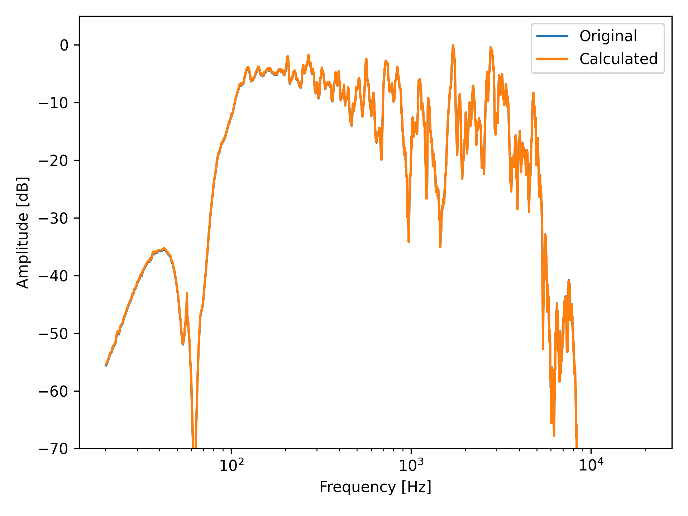
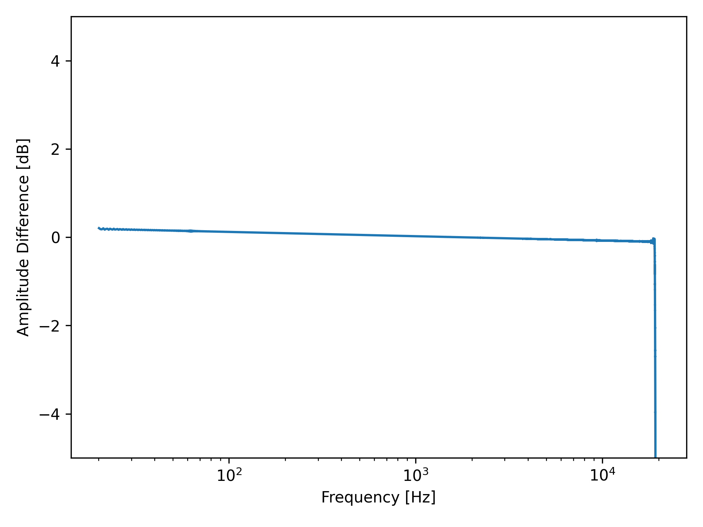
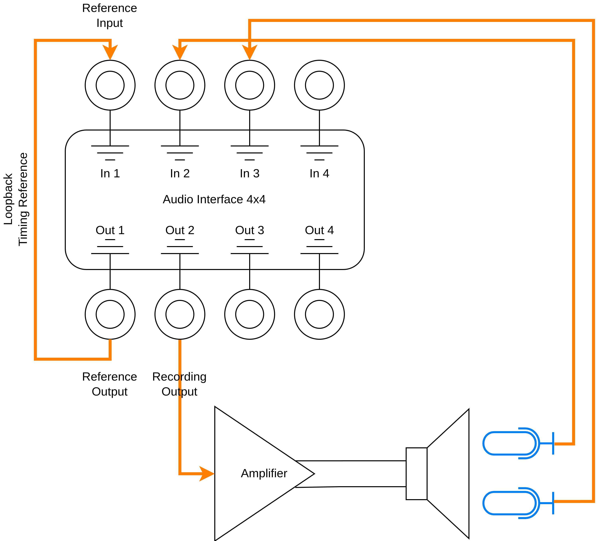
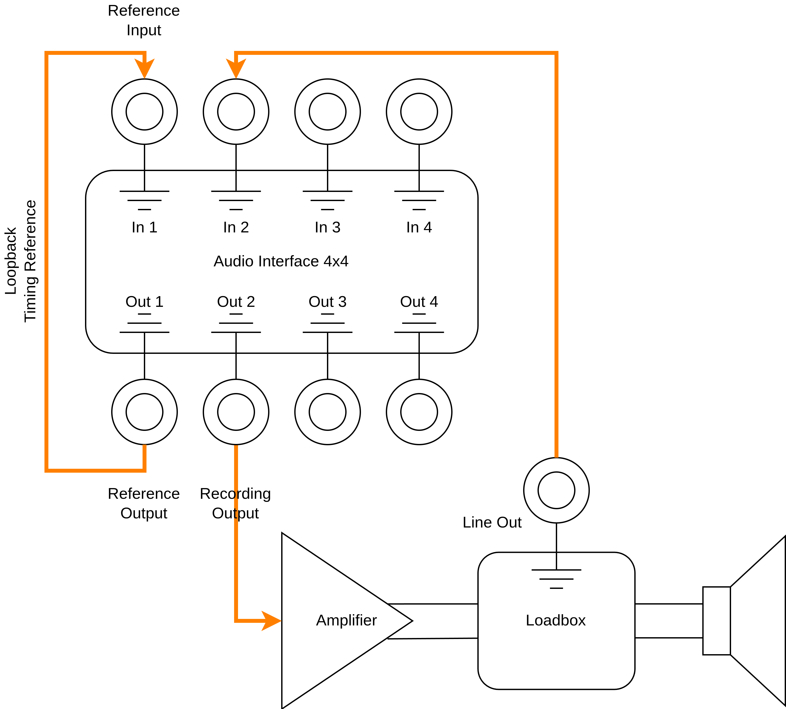
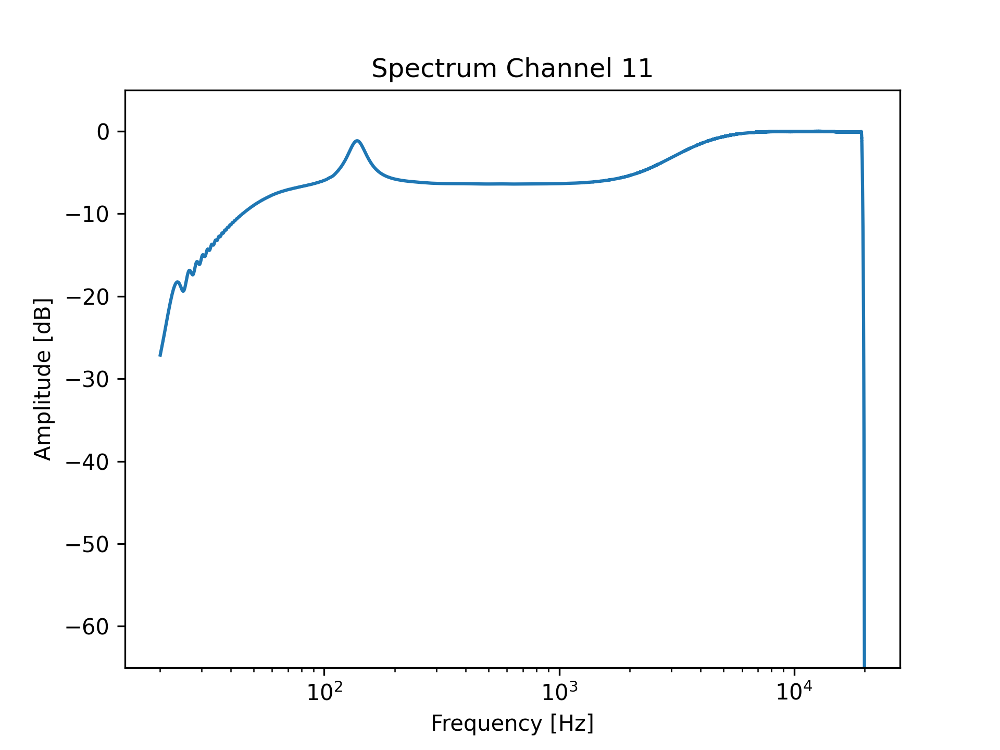
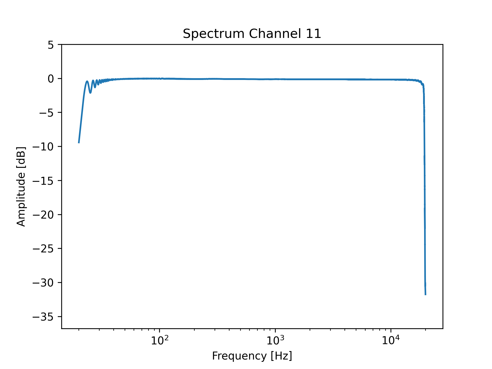

# ir_tools

Python command line tool to record speaker impulse responses from multiple channels.

Bases around exponential-sine-sweep method implemented in [scene-rir](https://sr.ht/~csevast/scene-rir/) library.

## Prerequisites

The tool needs a Python environment with the correct libraries installed. 
Tests were executed with a conda environment using Python3.13 and these [requirements](conda_requirements.yaml).

To create a suiting Python environment install conda (e.g. [miniforge](https://github.com/conda-forge/miniforge)) first.
Afterwards, create the environment and activate it:

```shell
conda env create -n ir-tools -f conda_requirements.yaml
conda activate ir-tools
```

## Modes

The tool provides two modes: a test mode and the actual recording mode.

### Test Mode

> [!NOTE]
> This mode is solely for testing and debugging!

The test mode is intended to check whether the algorithms are correct. 
It uses a given [impulse response](testdata/ir.wav), convolves it with a generated sine-sweep and calculated the IR from it.
Finally, the frequency spectrum of the original and the calculated IR are compared. The comparison is shown in the following figures.

|       Spectrum Comparison        |       Spectrum Difference        |
|:--------------------------------:|:--------------------------------:|
|  |  |

The results show that the original and the calculated data matches well, apart from frequencies very close to the Nyquist frequency.
This shows that the calculations performed by the tool and the underlying libraries are correct.

### Record Mode

The "record" mode is used to create impulse response measurements. The figure below shows a typical setup using 4-in/4-out soundcard.

> [!CAUTION]
> The amplifier used in this setup should provide a linear frequency response. Thus, preferably a solid state PA/HIFI amp is used.
> If for example a guitar tube-amplifier power section is used, the frequency response of the power section will be part of the IR.
> 
> However, it might be desired to include the power section of your amplifier, if you are using the preamp-out/effects-send to record guitars.



In this scenario, output 1 and input 1 are used for timing reference. 
This connection feeds back the original sine-sweep such that the IO-delay of the soundcard can be compensated.
Output 2 drives the speaker through an amplifier. The output of the amplifier is recorded by two microphones.
For both microphones, an impulse-response can be created simultaneously which ensures that the IRs are aligned like in the original setup.

## Audio Devices

Available audio devices can be checked with the sounddevice module:

```shell
python -m sounddevice
```

This will result in an output as follows:

```shell
< 0 HD-Audio Generic: EV2495 (hw:1,3), ALSA (0 in, 2 out)
  1 HD-Audio Generic: EV2495 (hw:1,7), ALSA (0 in, 2 out)
> 2 HD-Audio Generic: ALC293 Analog (hw:2,0), ALSA (2 in, 2 out)
  3 MOTU-AVB: - (hw:3,0), ALSA (24 in, 24 out)
  4 pulse, ALSA (32 in, 32 out)
```

Select the index corresponding to the sound card you intend to use and specify it later as device_id.

## CLI

General arguments: 
```shell
usage: ir_tools.py [-h] [--fs FS] [--f_start F_START] [--f_stop F_STOP] [--output_dir OUTPUT_DIR] [--show_plots] {test,record} ...

positional arguments:
  {test,record}         Mode selection
    test                Test mode
    record              Record mode

options:
  -h, --help            show this help message and exit
  --fs FS               The sampling frequency in Hz
  --f_start F_START     The starting frequency of the log-sine in Hz
  --f_stop F_STOP       The ending frequency of the log-sine in Hz
  --output_dir OUTPUT_DIR
                        The directory to store the output files
  --show_plots          Display plots
```

### Test Mode

```shell
usage: ir_tools.py test [-h] [--file FILE]

options:
  -h, --help   show this help message and exit
  --file FILE  An impulse response wave-file. File fs must match parameter fs
```

### Record Mode

```shell
usage: ir_tools.py record [-h] [--level LEVEL] [--trim_ir] [--shape_ir] [--fade_out FADE_OUT] [--start_offset START_OFFSET] [--ir_length IR_LENGTH]
                          device_id output_channel reference_output_channel reference_input_channel record_channels

positional arguments:
  device_id             The device id of the recording device
  output_channel        The output channel of the recording device
  reference_output_channel
                        The reference output channel of the recording device
  reference_input_channel
                        The reference input channel of the recording device
  record_channels       A list of input channels that should be recorded. Format: "[3, 4]"

options:
  -h, --help            show this help message and exit
  --level LEVEL         The output level during recording in dB
  --trim_ir             Trim the IR signal to length
  --shape_ir            Shape the IR signal by fade-in and fade-out
  --fade_out FADE_OUT   Relative length of fade-out
  --start_offset START_OFFSET
                        The number of samples before the start of the IR
  --ir_length IR_LENGTH
                        The length of the IR in samples
  --postfix POSTFIX     Postfix to be added to end of the file name
  --calibrate CALIBRATE
                        Path to an impulse response used for calibration. This can be obtained from a measurement without a speaker/before a speaker
```

## Example Usage

The tool would be executed with following parameter if the setup above is to be used and the MOTU-AVB sound device should be used.

> [!CAUTION]
> Channel indices start from 0. Thus, "Out 1" would be index 0.

```shell
python ir_tools.py --fs 48000 --f_start 1 --f_stop 20000 --output_dir <path/to/results> record 3 1 0 0 "[1, 2]"
```

Following parameters are used:

|            Parameter            |  Value   |
|:-------------------------------:|:--------:|
|       Sampling frequency        | 48000 Hz |
|         Start frequency         |   1 Hz   |
|         Stop frequency          |  20 kHz  |
|            Device ID            |    3     |
|         Output channel          |    1     |
| Timing reference output channel |    0     |
| Timing reference input channel  |    0     |
|       Recording channels        | 1 and 2  |

## Frequency Compensation

In case you are using for example a guitar amplifier power section to record impulse responses, it might be necessary to compensate for the non-linear frequency transfer function.
The tool offers the --calibrate option. This parameter expects an impulse response of the amplifier without cabinet.
Such an impulse response can be obtained with a setup like shown in the following figure.
In this case, a load box with speaker-through (no attenuation!) is used. Through the line out of such a device, the output of the 
amplifier can be recorded directly. Using the tool in this repo, we can then create an IR for the amplifier. This IR is further used in calibration/frequency compenstation.
Thus, we execute the script twice: once while recording the output of the amplifier and then to record the speaker. In the second run,
the IR from the first run is used as calibration input.

> [!CAUTION]
> This is still experimental. Check the output and run with --show_plots to verify result.

> [!CAUTION]
> Do not directly connect the output of your amplifier to your audio interface. Always use a device that converts the signal to line/instrument level.
> Damage might be possible if the amplifier is directly connected to the interface!

> [!NOTE]
> Compensation is limited to 40dB in order to improve the stability of the algorithm.



Following figures show the result of an experiment where an EQ was placed in the signal chain. The left figure shows the 
original spectrum of the recording where the EQ curve is visible. In the left figure, the IR from the first recording was used as compensation.
As the results show, the frequency response is almost linear, proving a correct algorithm.

|         Original Spectrum         |    Spectrum with Compensation     |
|:---------------------------------:|:---------------------------------:|
|     |  |